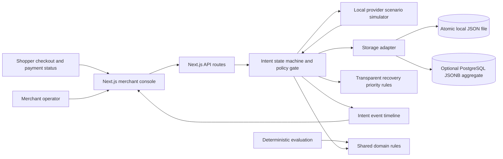
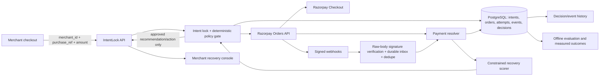

# IntentLock

IntentLock is a payment-recovery coordination product concept and a working local simulator. Its product promise is: **one purchase, one safe payment path, and a measured recovery attempt only after payment genuinely fails.** The local app demonstrates that promise with a realistic merchant operations console, customer checkout/status flow, deterministic payment-state rules, a simulated provider, and repeatable safety evaluation.

The project is inspired by the supplied `IntentLock Recovery Agent` brief. That brief describes a future integration between merchant checkout and Razorpay. This repository currently implements a local simulator: it does not call Razorpay, process money, receive webhooks, or measure real recovered revenue.

## Product concept

### Problem hypothesis

A merchant has a stable cart or purchase identity while a gateway has its own order/payment identities. If a retry creates a second provider order while an earlier payment is still unresolved, a delayed success can conflict with the retry. The intended product links all provider orders and attempts back to one merchant purchase reference, then prevents a second payment path until state is resolved.

This is a product hypothesis to validate with merchants, not a claim that all payment duplication is unsolved. The supplied brief explicitly recognizes existing gateway behavior for same-order retries and existing failed-payment recovery products. IntentLock’s proposed distinction is coordinating state across the merchant’s stable purchase reference and every provider order linked to that purchase, then measuring safe recovery against a baseline.

### Users and their needs

- **Shopper:** Know whether to wait or continue; never be asked to pay again while the earlier payment is unresolved.
- **Merchant support/operations:** See pending, eligible, paid, failed, and review-required purchases, with evidence and a clear next action.
- **Merchant engineering:** Preserve the link from a stable `purchase_ref` to provider orders, attempts, events, decisions, and outcomes.
- **Product/risk teams:** Measure whether recovery adds value without unsafe retries, duplicate fulfilment, or misleading revenue claims.

### Product boundary

The agent may recommend among a bounded set of recovery actions. A deterministic policy gate owns permission to act. The model/recommender must never decide that a payment succeeded, authorize money movement, or issue a refund. A browser callback or customer statement is not payment evidence. Ambiguous state fails closed to wait/reconciliation or human review.

## Current implementation

The current application is a single-merchant local simulator built with Next.js App Router, React, TypeScript, and server route handlers. It has two storage options:

1. **Default local mode:** Atomic JSON persistence at `.intentlock/store.json`; no database setup required. Writes are queued within one server process.
2. **Optional PostgreSQL mode:** Set `DATABASE_URL`; the app lazily creates `intentlock_state` and stores a single JSONB aggregate row. Mutations run in a transaction while holding `SELECT ... FOR UPDATE` on that row. This allows concurrent app processes to serialize updates, but it is not a normalized production payment schema. The PostgreSQL path is implemented but has not been verified against a running PostgreSQL instance in the development environment.

Both modes persist synthetic purchase intents, policies, linked provider-order IDs, event history, and state transitions. The deterministic local simulator stands in for the gateway and webhook resolver. There are no credentials, outbound payment calls, signed webhook endpoint, background workers, authentication, merchant tenancy, customer messaging, refunds, or production integrations.

## Architecture as implemented



### Main source files

- `src/app/page.tsx` — merchant console, payment list/detail drawer, simulator, shopper checkout and status views, policies, scenario evaluation, and audit UI.
- `src/app/globals.css`, `src/app/overrides.css` — visual system. Keep the established Razorpay-inspired payments-operations layout and IntentLock branding.
- `src/app/layout.tsx` — app shell and metadata.
- `src/lib/domain.ts` — status and event types, seed data, retry/attempt decisions, recommendation scoring, idempotency helpers, and state invariants.
- `src/lib/store.ts` — local JSON/PostgreSQL persistence adapter and schema bootstrap.
- `src/lib/evaluation.ts` — deterministic cases using shared domain functions; not a statistical model evaluation.
- `src/app/api/intents/route.ts` — list and idempotent intent creation.
- `src/app/api/intents/[id]/actions/route.ts` — local scenario actions and state transitions.
- `src/app/api/policies/route.ts` — read/update retry limit and waiting period.
- `src/app/api/evaluation/route.ts` — deterministic local evaluation report.
- `src/app/api/health/route.ts` — storage health, storage mode, and store version.
- `compose.yaml`, `.env.example` — optional local PostgreSQL setup.
- `AGENTS.md` — Next.js-generated repository guidance. It is maintained by Next.js; do not replace its generated block.
- `skills.md` — project-specific coding-agent handoff and continuation instructions.

## Payment and recovery workflow

1. Operator creates a payment or a merchant checkout submits `purchase_ref`, amount, and optional checkout metadata.
2. IntentLock creates one purchase intent and one canonical simulated provider order. A repeated reference with the same amount reuses the existing intent; a different amount is rejected.
3. The shopper opens the simulated checkout, selects UPI, card, or netbanking, and submits. This creates one pending attempt; it does not contact a payment provider.
4. The shopper status view polls the local API while state is unresolved and tells the shopper not to pay again.
5. The operator runs a scenario to simulate a terminal failure, capture, delayed capture, or duplicate capture.
6. A simulated terminal failure starts the configured wait. A safe retry can only be approved after provider-like failure evidence, elapsed wait, and remaining retry budget.
7. Retry approval is separate from payment submission. The attempt/retry counters advance only after the shopper submits checkout.
8. A capture marks the intent paid and releases one fulfilment. A later/additional capture links another simulated provider-order ID and moves the intent to merchant review; the system does not trigger another fulfilment or refund.
9. Every transition is appended to the intent’s event timeline with source and, where relevant, policy version/provider event ID.

## State model and safety invariants

Statuses currently used in code:

| Status | Meaning | Permitted next step |
| --- | --- | --- |
| `Ready to pay` | Canonical intent/order exists; no attempt submitted | Open checkout |
| `Payment pending` | Submitted attempt is unresolved | Reconcile/wait; retry is blocked |
| `Waiting to retry` | Terminal failure has been simulated/confirmed; configured wait is active or has just elapsed | Wait/recheck, then request retry eligibility |
| `Recovery eligible` | Failure, wait, and retry budget permit offering a bounded customer retry | Approve retry; customer still submits checkout |
| `Paid` | Capture evidence recorded | Fulfil once; do not retry |
| `Failed` | Terminal failure with no retry budget | Stop; no retry |
| `Review required` | Multiple/conflicting captures need a human decision | Hold automatic fulfilment; operator reviews |

Important invariants enforced in the domain/API:

- Retry is blocked unless the state is recovery-eligible/waiting, failure timestamp is valid, the configured wait elapsed, and the retry budget remains.
- A new attempt can start only for the first checkout from `Ready to pay`, or after an explicit retry approval from `Recovery eligible`.
- `Paid` requires at least one capture and records fulfilment once.
- More than one capture requires `Review required`.
- Unpaid states cannot be marked fulfilled; an already released fulfilment is not repeated by duplicate capture handling.
- Linked provider-order IDs are unique and the canonical order remains first.
- Repeated simulated provider event IDs are deduplicated per intent.
- Intent reference is stable; amount mismatch on reused reference returns conflict.
- Recovery recommendation is advisory. It does not itself change state, submit checkout, refund, or contact a customer.

## Merchant UI and shopper UI

The visual direction follows a familiar Razorpay payments-operations dashboard: compact left navigation, neutral surfaces, blue action emphasis, status pills, metric cards, payment table, detail drawer, and timeline. Branding remains IntentLock; this is not a copied Razorpay product or connected Razorpay dashboard.

The merchant console includes:

- Overview and recent payment activity (synthetic amounts are explicitly labeled).
- Payments/recovery queue, search, status and method filters, CSV export, payment detail, provider-order list, state evidence, event timeline, and recommendation.
- Scenario simulator for new checkout, confirmed failure, successful capture, delayed success, and duplicate capture.
- Retry/wait policy controls; mandatory verified-failure and duplicate-capture protections remain locked on.
- Deterministic scenario evaluation, integration simulator status, and audit event export.

The shopper experience is currently an in-app checkout/status overlay opened from the operator console, not a separately routable public checkout URL. Status polling runs while an intent is non-terminal. The simulator’s brand/product copy is illustrative.

The longer-term screen plan from the product brief includes a recovery overview (eligible amount, unresolved intents, recoveries and review queue), searchable purchase intents, intent evidence/timeline, recovery experiments with treatment/control results and confidence intervals, policy configuration including allowed methods/contact consent, integration/webhook health, and an auditable export. The current local UI implements simulator counterparts for these surfaces; it does not yet implement real cohort experiments, confidence intervals, gateway setup, or customer-message consent/workflows.

## Local setup

### Requirements

- Node.js 20.9 or newer.
- npm.
- Optional: Docker Compose for the PostgreSQL mode.

### Run with zero database setup

```bash
npm install
npm run dev
```

Open [http://localhost:3000](http://localhost:3000). The app creates `.intentlock/store.json` with seed data on first read. The health indicator should show **Local storage operational**. Use **Create payment** or **Run scenario** to exercise the flow.

### Run with PostgreSQL

The provided Compose database is for local development only; its example credentials are not production credentials.

```powershell
docker compose up -d db
Copy-Item .env.example .env.local
npm run dev
```

Or on macOS/Linux:

```bash
docker compose up -d db
cp .env.example .env.local
npm run dev
```

The first API request creates the `intentlock_state` table and initial simulator data. `DATABASE_URL` selects PostgreSQL; leave it unset for local JSON. The health route is `GET /api/health`. Switching stores does not migrate/copy data between JSON and PostgreSQL.

### Commands

```bash
npm run dev     # local development server
npm run lint    # ESLint
npm run build   # optimized Next.js production build
npm run start   # serve a production build
```

## API reference (local simulator)

All routes are local simulator APIs, not a public payment API. They have no authentication. Do not expose them to the public internet or use them to process real payments.

### `GET /api/intents`

Returns the local store snapshot, including `intents`, `retryLimit`, `waitMinutes`, `policyVersion`, and `version`.

### `POST /api/intents`

Creates or reuses an intent. Body fields: `purchase_ref` (optional, max 80 chars), positive numeric `amount`, `currency` (`INR` only, optional), `customer`, `email`, and `method` (metadata). Repeated reference + matching amount returns the existing intent; amount mismatch returns HTTP 409. If no reference is supplied, a local demo reference is generated.

### `POST /api/intents/:id/actions`

Simulator-only action body supports:

- `{ "action": "attempt_started", "method": "UPI" | "Card" | "Netbanking" }`
- `{ "action": "retry" }` — evaluate the current server policy and approve, but do not start the attempt.
- `{ "action": "failure", "provider_event_id": "...", "failure_occurred_at": "ISO timestamp" }`
- `{ "action": "capture" | "delayed_capture" | "duplicate_capture", "provider_event_id": "..." }`

Invalid transitions return HTTP 409; unknown actions/bad input return 400. Failure/capture actions model trusted simulator events only. There is no webhook signature verification in this local endpoint.

### `GET /api/policies`, `PUT /api/policies`

Read settings or write `{ "retryLimit": 0..3, "waitMinutes": 0..1440 }`. A changed policy increments `policyVersion`; events record the version used where applicable.

### `GET /api/evaluation`

Returns 11 deterministic software checks: unresolved retry, missing evidence, active wait, elapsed wait eligibility, approval boundary, recommendation boundary, exhausted budget, paid invariant, duplicate-capture invariant, provider-event dedupe, and purchase-reference idempotency. Baseline values `immediateRetryUnsafe` and `timerOnlyRetryUnsafe` are fixed modeled counts (4 and 2), not measured comparative experiment results.

### `GET /api/health`

Returns `status`, active `storage` (`local-json` or `postgresql`), and store `version`; returns HTTP 503 when storage cannot be read.

## Data model

### Current code model

- **Intent:** `id`, merchant `reference`, canonical `order`, `providerOrders[]`, customer display metadata, `amount`, `method`, `status`, `attempts`, `retryCount`, `retryApproved`, `capturedCount`, `fulfilled`, `failureConfirmedAt`, `note`, and `events[]`.
- **Intent event:** ID, timestamp, title/description, tone, source (`merchant`, `provider`, `policy`, `system`), optional provider event ID, optional policy version.
- **Store configuration:** `retryLimit`, `waitMinutes`, `policyVersion`, monotonic local `version`.

The PostgreSQL option persists this complete object as JSONB in one singleton row. It is suitable for this single-merchant local simulator, but it lacks relational uniqueness constraints for merchant tenancy, normalized queryable events/orders, a durable provider inbox/outbox, and independently retained decision records.

### Target production model from the product brief

A production design should use normalized, tenant-aware records such as `Merchant`, `PurchaseIntent`, `ProviderOrder`, `PaymentAttempt`, `ProviderEventInbox`, `RecoveryDecision`, `ActionExecution`, `PolicyVersion`, `ExperimentAssignment`, and `Outcome`. Enforce unique `(merchant_id, purchase_ref)` and provider event IDs in the database. Keep raw signed webhook material only as long as policy requires, encrypt sensitive data, and prevent secrets/credentials from entering model prompts. Capture immutable evidence and explicit decision/action outcomes for audit and evaluation.

Suggested meanings for those records:

- **PurchaseIntent:** stable merchant reference, amount/currency, current state, timestamps, and active policy version.
- **ProviderOrder:** gateway order ID linked to exactly one purchase intent, with provider status and canonical/secondary role.
- **PaymentAttempt:** payment ID/method/status, provider error fields, authorization/capture evidence, and attempt timestamps.
- **ProviderEventInbox:** verified raw event metadata, signature-verification result, provider event ID, receive/process times, deduplication key, and processing status.
- **RecoveryDecision:** eligible evidence snapshot, fixed allowed-action set, policy version, recommendation, rationale, score/confidence where justified, and accepted/rejected result.
- **ActionExecution:** idempotency key, approved action, actor, queued/submitted/result state, and provider response reference.
- **PolicyVersion:** immutable policy values/effective time and actor.
- **ExperimentAssignment:** treatment/control, assignment time, and eligible-at-entry features.
- **Outcome:** captured amount, refund/duplicate/fulfilment outcome, recovery time, and contact/support cost where available.

## Intended provider-backed architecture (not implemented)

The following is the future Razorpay-connected design from the project brief. It is a target, **not** the architecture currently running in this repository.



Intended provider workflow: create or reuse the canonical Razorpay order when the merchant submits a stable purchase reference; return the existing intent/order for repeated checkout requests; verify webhook signatures against the exact raw request body; persist/deduplicate valid events before asynchronous processing; reconcile critical or conflicting state through Razorpay’s current API state; do not regress a confirmed paid state because of an old/out-of-order event; let the scorer propose only an allowed action; let the deterministic policy gate accept/reject/downgrade it; record the actor and action result. Failure detail fields may be absent, so treat missing values as uncertainty. Never infer a bank-specific failure cause or downtime without a verified signal.

## Intended recovery-agent contract

The future scorer chooses an intervention, not payment truth. Give it only the minimum useful features: payment method, structured provider error fields, attempt count/timestamps, verified provider state, verified downtime signal when available, purchase amount band, active merchant policy, consent/capabilities for contacting the customer, and suitably governed historical outcomes. Exclude provider API secrets, PAN/CVV, UPI PIN, bank authentication data, and unrelated customer data.

The allowed action set in the source brief is:

| Action | Intended use | Hard boundary |
| --- | --- | --- |
| `WAIT_AND_RECHECK` | State is unresolved, evidence is missing, or a safe wait is active | Never start another attempt while unresolved |
| `RETRY_EXISTING_ORDER` | Provider confirms terminal failure; wait and retry budget permit it | Reuse the purchase/order path; require customer action and gate approval |
| `OFFER_SUPPORTED_ALTERNATIVE` | A supported alternate method may help after safe failure | Checkout must support it; customer chooses the instrument |
| `SEND_APPROVED_RECOVERY_MESSAGE` | Merchant-approved channel/template can contact an eligible customer | Require merchant approval and contact permission/consent |
| `HUMAN_REVIEW` | Conflicting captures/events, missing material evidence, or uncertain state | Hold automated fulfilment and risky action |
| `STOP_PAID` | Paid state is established | No retry; fulfil once; later capture goes to review |

An illustrative model response shape from the brief (values below are examples only and must never be shown as project results):

```json
{
  "action": "RETRY_EXISTING_ORDER",
  "estimated_success_probability": 0.31,
  "expected_net_recovery": 146.5,
  "evidence": ["provider reports terminal failure", "retry budget available"],
  "confidence": 0.78
}
```

The long-term ranking objective is estimated recovered margin minus payment fees, messaging cost, and expected support/refund cost. These estimates require real appropriately labeled outcomes and calibration; without that data the deterministic rules in the current app are the baseline, not an AI model. Do not use a contextual bandit until randomized outcome data is adequate; historical action selection is biased and can mislead learning.

## Intended benchmark and merchant proof plan

The local 11-case evaluation only checks coded rules. A later offline evaluation should include ordinary success/failure, delayed and out-of-order success, duplicate webhook delivery, repeated checkout for one reference, multiple provider orders linked to one intent, concurrent attempts, missing/conflicting evidence, and verified versus unverified downtime signals. Split by merchant, scenario family, and time rather than random rows alone to reduce leakage.

Compare against the merchant’s existing safe policy, a fixed-delay strategy, provider-native same-order behavior, and IntentLock. Report at least:

- Incremental recovered amount versus a safe baseline.
- Recovery conversion among eligible confirmed failures.
- Duplicate captures and duplicate fulfilments.
- Unsafe retries while any earlier attempt is unresolved.
- False holds of confirmed failures.
- Manual-review rate and time to resolution.
- Model calibration and action performance by failure category.

Never create an unsafe retry treatment group merely to get a control. Merchant validation should start with interviews and observation of the current order-reference/retry flow; then shadow mode that does not alter checkout; verify whether cross-order retries/conflicts occur; only then propose a consented limited pilot with rollback and measure real outcomes. The initial target is one online merchant using Razorpay Orders/Checkout and a stable purchase reference—not marketplace-wide or subscription coverage. A synthetic run proves only that the modeled software cases behave as coded.

## Intended technology stack (future production path)

These are options in the original brief, not dependencies already present:

| Layer | Candidate technology | Current repository state |
| --- | --- | --- |
| Merchant/shopper app and local API | Next.js, React, TypeScript | Implemented |
| Input validation | Zod or equivalent | Current route validation is manual |
| Durable normalized storage | PostgreSQL with Prisma/Drizzle or SQL | Optional PostgreSQL JSONB aggregate exists; no ORM/normalized migrations |
| Reconciliation/action workers | Redis + BullMQ | Not implemented |
| Payment integration | Razorpay Node SDK, test-mode keys | Not implemented |
| Offline model/evaluation | Python, pandas, scikit-learn/LightGBM | Not implemented; deterministic TS checks only |
| Model serving | Versioned model or small worker service | Not implemented |
| Deployment | Docker Compose locally; separate web/API/worker and managed DB/Redis for pilot | Only local optional DB Compose service is included |
| Observability | Structured logs, correlation IDs, latency/error dashboards | Not implemented |

## Recovery recommendation and AI scope

`scoreRecoveryAction` in `src/lib/domain.ts` is a deterministic, transparent urgency/action rule. Current priority is status-based (for example, review and unresolved payments rank high; paid states require no action). The score is not a success probability, expected net recovery, learned model, or revenue estimate.

The intended future AI scorer may select only from a fixed action set such as:

- `WAIT_AND_RECHECK`
- `RETRY_EXISTING_ORDER`
- `OFFER_SUPPORTED_ALTERNATIVE`
- `SEND_APPROVED_RECOVERY_MESSAGE`
- `HUMAN_REVIEW`
- `STOP_PAID`

It should estimate recovery probability/net value only from appropriate merchant outcome data and return structured evidence/confidence. The deterministic gate must validate each recommendation against current verified provider state, retry limits, wait windows, merchant policy, consent, supported payment methods, and human-review conditions. No model can execute money movement or refund. Until there is suitable labeled data, keep rules as the honest baseline; do not invent synthetic training or claim lift.

## Evaluation and evidence

The current Experiments screen checks application rules using the same pure domain helpers as the API. It is a reproducible software-safety check, not a benchmark proving recovery. It does not model network outages, webhook signature security, concurrent race behavior in a live PostgreSQL server, empirical payment behavior, or revenue lift.

Before making outcome claims, build an appropriately governed dataset with normal success/failure, delayed/out-of-order success, duplicate webhook delivery, same-reference checkout retries, cross-order captures, concurrent actions, missing/conflicting evidence, and verified/unverified downtime signals. Split evaluation by merchant or scenario family and time to reduce leakage. Compare with the merchant’s existing safe process, fixed retry policy, and provider-native same-order behavior. Report incremental recovered amount, conversion among eligible failures, duplicate capture/fulfilment, unsafe retry rate, false holds, manual-review rate/time, and calibration. A synthetic run only proves behavior for its modeled cases.

## Security, privacy, and operational boundaries

- This is a local single-merchant simulator. APIs have no auth, authorization, rate limits, CSRF defenses, or tenant isolation; do not deploy publicly.
- Do not add live Razorpay integration without credentials supplied through a secure secret store, provider test-mode configuration, signature verification, API reconciliation, and explicit user/product approval.
- Webhook signatures must be checked against the exact raw request body before parsing. Persist/deduplicate verified events before asynchronous processing; reconcile critical status with the provider API.
- Fail closed on missing or conflicting payment evidence. Never turn a client callback into `Paid` or `Recovery eligible`.
- Do not collect/store PAN, CVV, UPI PIN, bank credentials, or payment secrets. The current customer/email fields are synthetic display metadata.
- No refunds, customer messages, or external communications are implemented. Such operations require explicit merchant policy, consent, and human review as applicable.
- `.env.local`, credentials, real customer data, and database dumps must remain untracked. `.env.example` contains local-only development values.
- Simulator counts, seeded values, graph values, recommendations, and evaluation baselines must remain labeled synthetic/modeled.

## Delivery phases and present status

1. **Product problem and boundaries — captured.** Source: supplied recovery-agent brief. Merchant validation remains future work.
2. **Local identity/state simulator — implemented locally.** Idempotent purchase references, retry gate, event timeline/dedupe, capture and duplicate-capture handling, local JSON, optional PostgreSQL aggregate adapter. PostgreSQL runtime not verified; live provider/webhook inbox/resolver remain future work.
3. **Merchant and shopper experience — local simulator implemented.** Console, detail, policies, audit/export, checkout/status overlays. Standalone customer URL, authentication, responsive/browser accessibility audit, and production copy remain possible follow-up work.
4. **Scenario evaluation — implemented as 11 deterministic checks.** No empirical benchmark or real revenue measurement.
5. **Recovery recommendation — deterministic rules implemented.** Learned ranking waits for labeled outcome data and a valid evaluation plan.
6. **Shadow mode and merchant pilot — not started.** Needs merchant discovery/data, a production-grade backend, signed provider events and reconciliation, security review, consent, and a separately agreed pilot.

## Suggested next work

1. Verify PostgreSQL end to end with Docker Compose: startup, schema bootstrap, create/update/read, persistence after restart, health failure behavior, and concurrent updates. Fix any defects; retain local JSON as fallback.
2. Add automated tests for state transitions, idempotency, event dedupe, policy changes, capture conflicts, and PostgreSQL concurrency. The current 11-case evaluation is not a substitute for a test runner.
3. Consider migrating from JSONB aggregate to normalized schema/ORM only if query, tenancy, audit retention, or production needs justify the change; plan and test a data migration.
4. Improve the customer status experience to a separately routable, non-guessable customer URL if the product requires a realistic merchant-to-shopper handoff; define auth/access, expiry, and privacy first.
5. Keep live provider integration and AI training out of scope until credentials/data, security requirements, and merchant validation are available.

## Product brief reference

The full original concept and planned future architecture are in the supplied attachment named **IntentLock Recovery Agent Track: AI Revenue Recovery**. `skills.md` in this repository has continuation instructions and a compact handoff checklist for coding agents.
